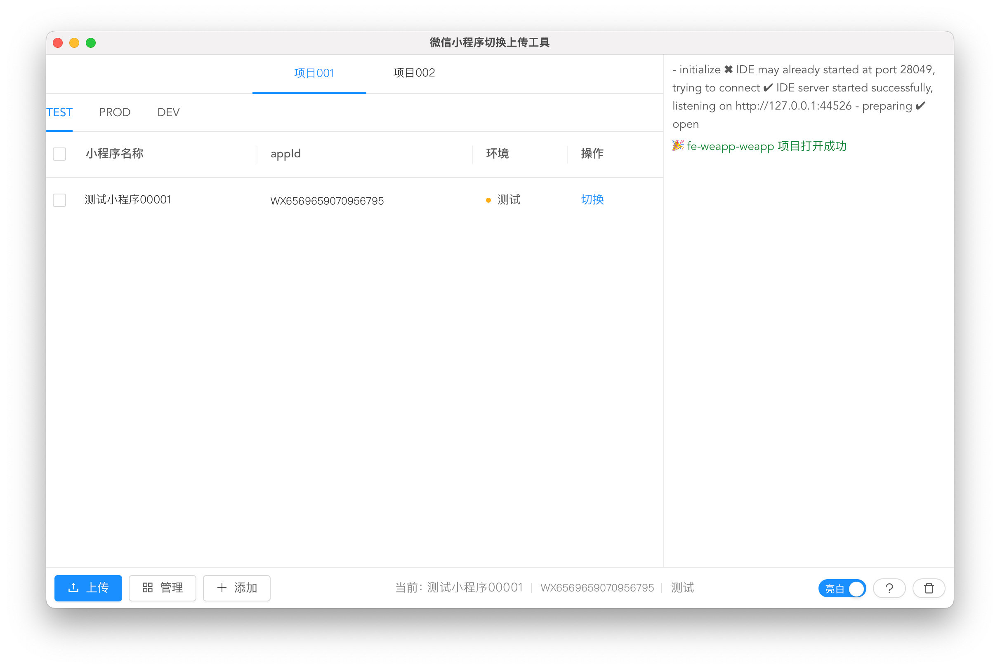
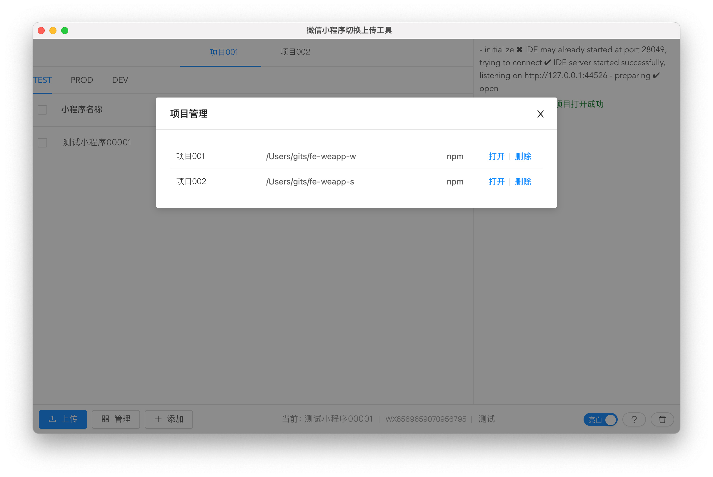
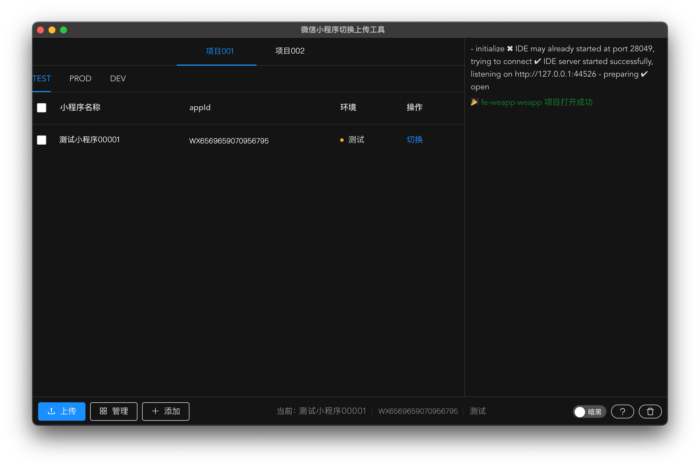

# 微信小程序上传管理界面化客户端工具


## 工具介绍
该工具是一款适用于一个工程项目有多个微信小程序，且需要上传、打开、切换管理的`可视化界面`工具。

功能特色：
* 界面化管理，无需每次操作都输入命令;
* 每个工程项目支持配置多个环境，每个环境下的小程序数量不限；
* 单个环境下的多个小程序队列打包上传，上传支持提交版本号和注释；
* 多个小程序之间方便地切换；
* 可调起微信开发者工具打开工程项目；
* 界面支持白色和黑色两种主题；

## 工具架构
基于Vue2+Electron+NodeJs开发，调用微信开发者工具的API，通过Electron-vue封装成桌面应用，可根据自己的操作系统构建对应可用的客户端，支持构建macOS、Windows、Linux三个平台的客户端。

## 适用场景
1. 单个工程项目至少有2个小程序，小程序分别对应开发/测试/生产环境，且有很多个小程序工程项目；
2. 快速切换一个项目里不同appId的小程序，无需每次修改代码和进入微信开发者工具-详情里切换；
3. 本地小程序工程一套代码有多个appId，要分别上传到对应appId的小程序；

## 配置思路
1. 在需要使用的小程序工程根目录新建一个`weapp.config.json`文件，用于本工具读取和管理；
2. 在小程序工程的一个现有文件里(例如`utils.ts`)导出`CURRENT_APPID`变量，用于本工具读取当前环境的appId；
3. 微信开发者工具里的一些配置；

## 配置步骤
1. 在小程序工程的根目录新建一个`weapp.config.json`文件，内容格式如下：
```json
{
  "name": "小程序工程名称，界面Tab标签上显示的名称",
  "description": "小程序的描述",
  "currentAppIdFilePath": "/src/utils/utils.ts",
  "appList": {
    "DEV": [
      {
        "appId": "yourappid0000001",
        "name": "界面上显示的小程序名称01",
        "code": "DEV",
        "env": "dev"
      }
    ],
    "TEST": [
      {
        "appId": "yourappid0000002",
        "name": "界面上显示的小程序名称02",
        "code": "TEST",
        "env": "test"
      }
    ],
    "PROD": [
      {
        "appId": "yourappid0000003",
        "name": "界面上显示的小程序名称03",
        "code": "PROD",
        "env": "prod"
      }
    ]
  }
}
```
说明：
  * 修改`currentAppIdFilePath`相对路径，是你电脑上当前小程序工程里`CURRENT_APPID`所在文件的路径，如果没有参照下面第2步添加；
  * 修改`name`和`description`的值；
  * 修改和添加每个环境下小程序信息，`code`需设为`整个json里唯一`；
  * 以上json属性都是必须的，该工具会用到。可以增加额外属性以便项目中使用；
  * 每个小程序工程对应的全部appId都放在这个文件里，以便在项目里引用和后续维护。

2. 在你的小程序项目配置常量的文件里，加上如下代码：
```js
export const CURRENT_APPID = 'yourappid0000001'
```
说明：
 * 写法需要按照上面来，使用该工具切换小程序后，会自动更新上面的`CURRENT_APPID`。
 * 以上步骤只需配置一次，后面根据情况修改即可。


## 使用前确认
1. ⚠ 打开微信开发者工具顶部菜单「设置 -> 安全设置」，开启服务端口。

2. 确认已在微信开发者工具打开了当前小程序工程；
 * 该工具只能在微信开发者工具当前小程序下切换不同appId，不能切换微信开发者工具里导入的不同小程序。

3. 确认你的小程序工程根目录下有微信开发者工具生成的`project.config.json`文件；

4. 开始使用吧。


## 常见问题

### 1. 现有的小程序工程已经有AppId的常量，且不叫`CURRENT_APPID`怎么改造？

按照上面添加了`CURRENT_APPID`后，在已有常量的文件里，添加如下代码：
```js
export const YOUR_APPID = CURRENT_APPID
```

### 2. 在现有的小程序工程，如何获取当前AppId对应的环境是什么？

在需要获取当前环境名的工具文件里，添加如下代码：
```js
import weappData from '../../weapp.config.json'

const getAppInfoMap = () => {
  const data = {}
  Object.keys(weappData.appList).forEach(env => {
    weappData.appList[env].forEach(item => {
      data[item.appId] = {
        appName: item.appName,
        env: item.env,
      }
    });
  })
  return data
}

export const APP_INFO_MAP = getAppInfoMap()

export const env = APP_INFO_MAP[CURRENT_APPID] ? APP_INFO_MAP[CURRENT_APPID].env : 'test'
```


## 工程命令

### 本地开发
```
npm run electron:serve
```

### 构建客户端
```
npm run electron:build
```

## 客户端界面截图




